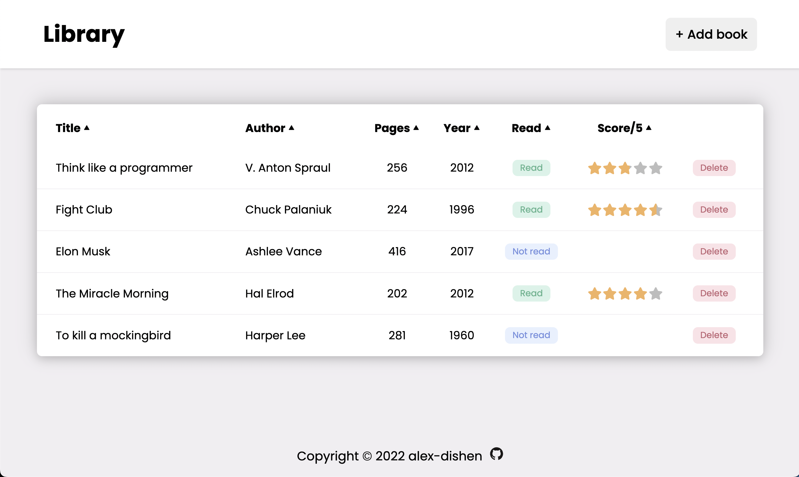

# Library
The **Library** project is created according to the assignment from **The Odin Project** [course](https://www.theodinproject.com/paths/full-stack-javascript/courses/javascript).
 
 

### 🔗 **Live preview** of the project is [here](https://alex-dishen.github.io/library/).

## **Features**
* Ability to add book to the library
* If a user read the book he/she can mark it as 'Read' and if not mark it as 'Not read'
* If the user read the book he/she can rate the book from 0 to 5 using stars
* If the user accidentally stated he/she 'Read' the book, he/she can change book status in the library to 'Not read'. If he/she does so, the stars will disappear.
* If the user created the book with a status 'Not read', he/she can change it's status by clicking on 'Not read' button changing it to 'Read'. Then a little menu will appear to rate the book if user wants
* Ability to delete book from the library

## **Outcome**
* Used **HTML**
* Used **CSS**
* Used **JavaScript**
* Improved usage of tables
* Strengthened styling
* Learned about Object Constructors
* Tremendously improved usage of JavaScript

## **Navigation**
* See my next project [Tic Tac Toe](https://github.com/alex-dishen/tic-tac-toe)
* See my previous project [Admin Dashboard](https://github.com/alex-dishen/admin-dashboard)